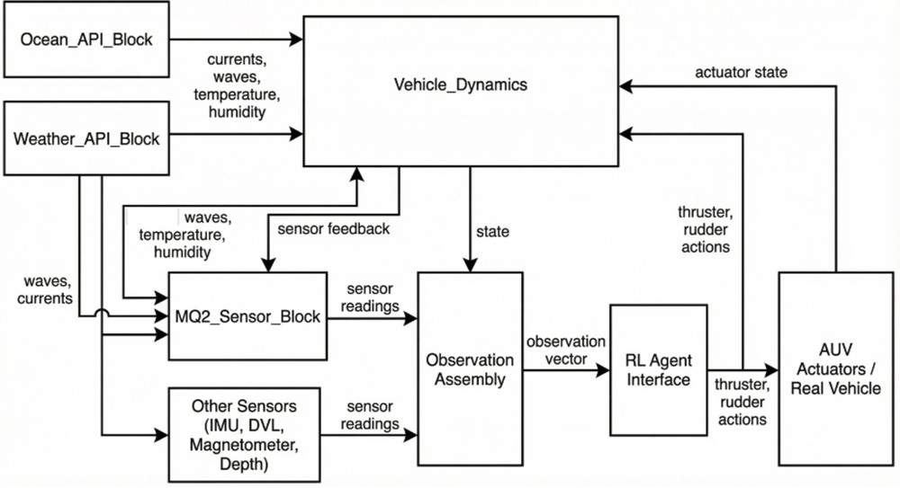
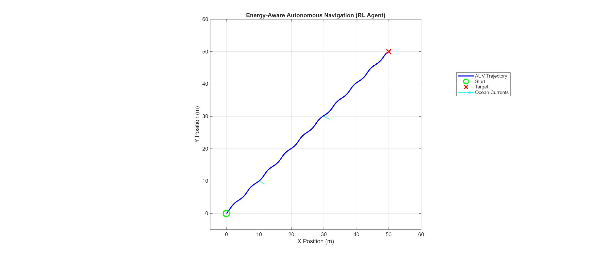
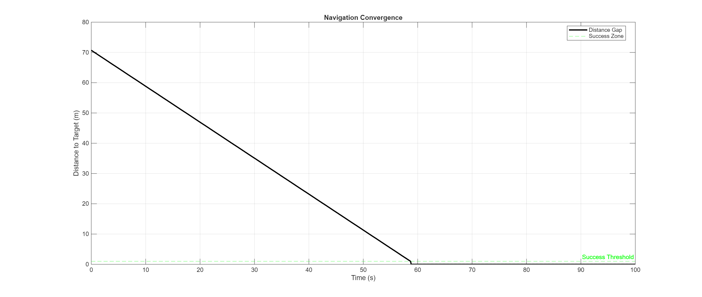
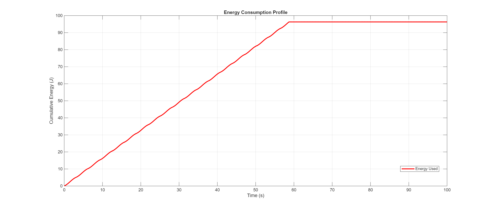

# Digital Twin-Based Reinforcement Learning Control for REMUS 100 AUV

> Energy-Aware Autonomous Underwater Vehicle Control using Reinforcement Learning, Digital Twin Technology, Physics-Based Sensor Modeling, and Real-Time Marine Environmental Data.


---

# Table of Contents

- Overview
- Why This Project Matters
- Key Features
- System Architecture
- Digital Twin Architecture
- Technologies Used
- Reinforcement Learning Framework
- Sensor Modeling
- Training Workflow
- Results
- Project Structure
- Installation
- Usage
- Future Improvements
- Patent
- Authors

---

# Overview

Autonomous Underwater Vehicles (AUVs) are extensively used for oceanographic research, underwater exploration, environmental monitoring, offshore inspection, and defense applications. These vehicles operate in highly dynamic underwater environments where currents, waves, turbulence, and weather conditions continuously influence navigation performance.

Traditional control methods such as PID controllers often struggle to adapt to these changing environmental conditions and frequently consume excessive energy while maintaining stability.

This project presents a **Digital Twin-Based Reinforcement Learning Framework** for the REMUS 100 Autonomous Underwater Vehicle. The framework integrates:

- High-Fidelity Digital Twin Modeling
- Reinforcement Learning-Based Control
- Real-Time Marine Environmental Data
- Physics-Based Sensor Modeling
- Multi-Objective Reward Optimization

The trained agent learns how to navigate efficiently, exploit favorable ocean currents, minimize energy consumption, and maintain navigation accuracy in realistic marine environments.

---

# Why This Project Matters

Modern autonomous systems must operate intelligently in uncertain environments.

Underwater vehicles face several challenges:

### Energy Constraints

AUVs rely on limited onboard batteries.

Poor control decisions can significantly reduce mission duration.

### Dynamic Marine Conditions

Ocean currents and waves continuously change.

Controllers must adapt in real time.

### Sim-to-Real Gap

Most AI models perform well in simulation but fail when deployed in real environments due to unrealistic training conditions.

### Multi-Objective Optimization

AUV missions require simultaneous optimization of:

- Navigation Accuracy
- Energy Efficiency
- Stability
- Sensor Performance

This project addresses all these challenges using a Digital Twin and Reinforcement Learning.

---

# Key Features

- REMUS 100 Digital Twin
- PPO-Based Reinforcement Learning Controller
- Energy-Aware Navigation
- Ocean Current Compensation
- Physics-Based Sensor Modeling
- Real-Time Environmental Data Integration
- Multi-Objective Reward Optimization
- Continuous Action Control
- Sim-to-Real Transfer Pipeline
- MATLAB & Simulink Implementation
- Marine Robotics Application

---

# System Architecture

The complete system operates as a closed-loop intelligent control framework.

<p align="center">
  
</p>

## Architecture Workflow

```text
Environmental Data
(Currents, Waves, Temperature)
                │
                ▼
       Digital Twin Model
                │
                ▼
       Observation Vector
                │
                ▼
        PPO RL Agent
                │
                ▼
     Thruster & Rudder Commands
                │
                ▼
           REMUS 100
                │
                ▼
        Sensor Feedback
                │
                └────────────► Digital Twin
```

The reinforcement learning agent continuously interacts with the digital twin, learns from environmental feedback, and improves its navigation strategy through repeated training episodes.

---

# Digital Twin Architecture

A Digital Twin is a virtual representation of a real-world system.

In this project, the digital twin simulates:

- Vehicle Dynamics
- Ocean Disturbances
- Sensor Behavior
- Energy Consumption
- Vehicle Navigation

<p align="center">
  
</p>

## Major Components

### Vehicle Dynamics Model

Simulates:

- Hydrodynamic Forces
- Vehicle Motion
- Drag Effects
- Thruster Response

### Environmental Interface

Retrieves marine data including:

- Ocean Currents
- Wave Information
- Water Conditions
- Environmental Variables

### Sensor Layer

Provides simulated outputs for:

- IMU
- DVL
- Magnetometer
- Depth Sensor
- MQ-2 Gas Sensor

### Observation Assembly

Combines all system states and sensor measurements into a reinforcement learning observation vector.

---

# Technologies Used

## MATLAB

MATLAB serves as the primary computational platform.

Used for:

- Mathematical Modeling
- Data Processing
- RL Training
- Performance Evaluation
- Visualization

### Why MATLAB?

MATLAB provides a rich ecosystem for robotics, control systems, optimization, and machine learning.

---

## Simulink

Simulink provides a graphical environment for modeling complex engineering systems.

Used for:

- Vehicle Dynamics Simulation
- Sensor Simulation
- Environmental Modeling
- Digital Twin Construction

### Why Simulink?

It allows engineers to visualize and test complex systems before physical deployment.

---

## Digital Twin Technology

A Digital Twin is a virtual replica of a physical asset.

### Benefits

- Safe Training Environment
- Reduced Development Cost
- Faster Experimentation
- Improved System Understanding
- Better Sim-to-Real Transfer

---

## Reinforcement Learning

Reinforcement Learning enables an agent to learn through interaction with an environment.

Unlike traditional controllers that follow fixed rules, RL agents learn optimal behaviors through experience.

### Benefits

- Adaptability
- Continuous Learning
- Autonomous Decision Making
- Multi-Objective Optimization

---

## PPO (Proximal Policy Optimization)

The reinforcement learning algorithm used in this project is PPO.

### Why PPO?

PPO is one of the most successful RL algorithms for continuous control tasks.

Advantages:

- Stable Training
- Continuous Action Spaces
- Efficient Learning
- Strong Convergence Performance

---

## Marine Environmental APIs

Environmental realism is achieved through:

### Open-Meteo Marine API

Provides:

- Ocean Currents
- Wave Height
- Sea Conditions

### NOAA Marine Data

Provides:

- Environmental Forecasts
- Ocean Measurements

These APIs make the simulation significantly more realistic.

---

# Reinforcement Learning Framework

## How Reinforcement Learning Works

The RL agent learns using trial-and-error interactions.

### Observation

The agent observes:

```text
Position Error
Velocity
Heading
Ocean Currents
Wave Data
Sensor Measurements
Energy Usage
```

### Action

The agent outputs:

```text
Thruster Command
Rudder Command
```

### Reward

Rewards encourage:

- Progress Toward Target
- Energy Efficiency
- Stability
- Better Sensing Performance

The agent continuously improves its policy by maximizing cumulative reward.

---

# Neural Network Architecture

The PPO controller uses an Actor-Critic architecture.

```text
Observation Vector
         │
         ▼
   Dense Layer
      128
         │
        ReLU
         │
         ▼
   Dense Layer
      128
         │
        ReLU
         │
 ┌───────┴────────┐
 ▼                ▼
Actor          Critic
Policy      Value Function
```

### Actor

Generates control actions.

### Critic

Evaluates action quality.

Together they learn optimal navigation behavior.

---

# Sensor Modeling

One of the major innovations of this project is realistic sensor simulation.

## IMU

Provides:

- Acceleration
- Angular Velocity
- Orientation

---

## DVL

Provides:

- Velocity Estimation
- Position Tracking

---

## Magnetometer

Provides:

- Heading Information
- Direction Estimation

---

## Depth Sensor

Provides underwater depth measurements.

---

## MQ-2 Gas Sensor Digital Twin

Unlike simple simulations, this project models:

- Heater Warm-Up Effects
- Sensor Response Curves
- Multi-Gas Sensitivity
- Temperature Compensation
- Humidity Compensation

This improves realism and supports sim-to-real deployment.

---

# Training Workflow

## Step 1

Initialize:

- Digital Twin
- Sensors
- Environmental Conditions

---

## Step 2

Generate Observation Vector

```text
Vehicle States
+
Environmental Data
+
Sensor Measurements
```

---

## Step 3

Agent Generates Actions

```text
Thruster Output
Rudder Output
```

---

## Step 4

Apply Actions

The digital twin updates vehicle motion.

---

## Step 5

Compute Reward

Reward includes:

- Navigation Progress
- Energy Savings
- Stability
- Sensor Quality

---

## Step 6

Update PPO Policy

The neural network weights are updated.

---

## Step 7

Repeat Until Convergence

Thousands of training episodes are performed.

The agent gradually learns optimal navigation behavior.

---

# Results

The trained PPO agent successfully learned energy-efficient navigation strategies.

---

## Autonomous Navigation Path

<p align="center">
  
</p>

### Observations

- Successfully reaches target waypoint
- Smooth navigation trajectory
- Effective current compensation
- Stable control behavior

---

## Navigation Convergence

<p align="center">
  
</p>

### Observations

- Distance-to-target decreases consistently
- Fast convergence
- Successful mission completion

---

## Energy Consumption

<p align="center">
  
</p>

### Observations

- Lower energy usage
- Improved mission endurance
- Efficient thruster utilization
- Energy-aware control policy

---

# Project Structure

```text
Digital-Twin-RL-Control-for-REMUS100-AUV
│
├── Codebase/
│   ├── run.m
│   ├── setupAgent.m
│   ├── evaluate_and_plot.m
│   ├── fetch_env_data.m
│   └── Sensor Models
│
├── Simulink/
│   └── Remus_AUV_twin.slx
│
├── Results/
│   ├── Top_Level_Architecture.png
│   ├── Digital_Twin_Architecture.png
│   ├── navigation_ath.png
│   ├── energy_consumption.png
│   └── convergence.png
│
├── Docs/
│   ├── Project_Report.pdf
│   └── Patent_Document.pdf
│
├── Trained_models/
│   ├── Trained_Remus_Agent.mat
│   └── Trained_Remus_Agent_Final.mat
│
├── README.md
├── Requirements.md
├── LICENSE
└── .gitignore
```

---

# Installation

1. Install MATLAB R2024a or later
2. Install Simulink
3. Install Reinforcement Learning Toolbox
4. Install Deep Learning Toolbox
5. Clone the repository

```bash
git clone https://github.com/your-username/Energy-Aware-AUV-Control-Using-RL-and-Digital-Twin.git
```

---

# Usage

Open MATLAB and run:

```matlab
run.m
```

For evaluation:

```matlab
evaluate_and_plot.m
```

To modify the PPO agent:

```matlab
setupAgent.m
```

---

# Future Improvements

- Real AUV Deployment
- NVIDIA Jetson Integration
- Raspberry Pi Deployment
- Sonar-Based Obstacle Avoidance
- Multi-Agent AUV Coordination
- Adaptive Current Estimation
- Real-Time Ocean Mapping
- Swarm Intelligence
- 3D Path Planning

---


# Authors

**Devanshi Das**  


